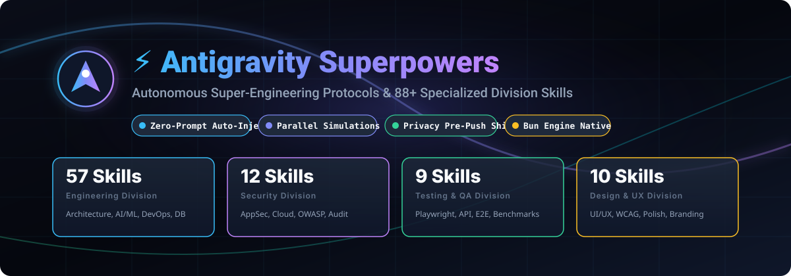
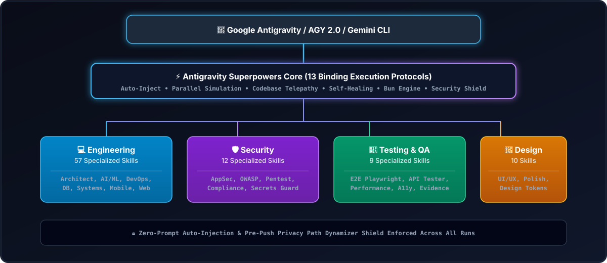

<div align="center">



# ⚡ Antigravity Superpowers

> **Autonomous Superpowers & 91+ Specialized Division Skills for Google Antigravity, Claude Code, Cursor, OpenCode, Windsurf, Cline, and AI Agents.**

[](https://www.npmjs.com/package/@mamdouh-aboammar/antigravity-superpowers)
[](LICENSE)
[](https://bun.sh)
[](#-specialized-divisions-matrix-91-skills)
[](#-skillssh--vercel-web-portal)
[](#-homebrew-distribution)
[](#-supported-ai-agents--adapters)

</div>

---

> [!IMPORTANT]
> **Zero-Setup & Zero-Prompt Auto-Injection**: All 13 core protocols and 91 specialized division skills are automatically loaded across your AI agent environments. No manual slash commands or complex configuration needed—simply ask and your AI agent executes with full division capabilities.

---

## 🚀 Multi-Channel Installation & Distributions

Install **Antigravity Superpowers** and **91 Specialized Division Skills** globally or locally via your preferred channel:

### 1. One-Line Curl Installer (Recommended)

```bash
# Standard install (Antigravity & local project)
curl -fsSL https://raw.githubusercontent.com/imMamdouhaboammar/antigravity-superpowers/master/install.sh | bash

# Install across all detected AI agents (Antigravity, Claude, Cursor, OpenCode, Windsurf, Cline)
curl -fsSL https://raw.githubusercontent.com/imMamdouhaboammar/antigravity-superpowers/master/install.sh | bash -s -- --all-agents
```

### 2. Homebrew Distribution

```bash
# Tap and install via Homebrew
brew tap imMamdouhaboammar/antigravity-superpowers https://github.com/imMamdouhaboammar/antigravity-superpowers.git
brew install antigravity-superpowers

# Activate across all agents
antigravity-superpowers install --all-agents
```

### 3. Skills.sh Registry (All AI Tools)

```bash
# Add entire superpowers suite to any skills.sh-compatible agent
npx skills add imMamdouhaboammar/antigravity-superpowers

# Or install individual specialized skills
npx skills add imMamdouhaboammar/antigravity-superpowers/engineering-software-architect
npx skills add imMamdouhaboammar/antigravity-superpowers/security-appsec-engineer
```

### 4. Bun / npx CLI Package

```bash
# Using Bun (Fastest)
bunx @mamdouh-aboammar/antigravity-superpowers install --all-agents

# Using npx
npx @mamdouh-aboammar/antigravity-superpowers install --all-agents
```

### 5. Git Clone & Local Development

```bash
git clone https://github.com/imMamdouhaboammar/antigravity-superpowers.git
cd antigravity-superpowers
bun install
bun run install.ts --all-agents
```

---

## 🤖 Supported AI Agents & Adapters

Antigravity Superpowers includes native configuration adapters for all major agent harnesses:

| Agent / IDE | Global Path | Project Workspace | Features |
|---|---|---|---|
| **Google Antigravity & Gemini CLI** | `~/.gemini/config/skills/` | `.agents/skills/` | Plugins, `PreToolUse` privacy hook, full AST routing |
| **Anthropic Claude Code** | `~/.claude/skills/` | `.claude/skills/`, `CLAUDE.md` | Core instructions injected into `CLAUDE.md` |
| **Cursor IDE** | `~/.cursor/skills/` | `.cursor/rules/`, `.cursorrules` | `.cursor/rules/antigravity-superpowers.mdc` rule injection |
| **OpenCode AI** | `~/.config/opencode/skills/` | `.opencode/skills/` | Native `opencode.json` & skill mirror integration |
| **Codeium Windsurf** | `~/.codeium/windsurf/` | `.windsurfrules`, `.windsurf/` | Cascade-ready superpowers rule block |
| **Cline & Roo-Code** | `~/.cline/skills/` | `.clinerules`, `.roomodes` | Autonomous task mode prompt integration |
| **Universal & Copilot** | `~/.agents/skills/` | `.agents/skills/`, `AGENTS.md` | `.github/copilot-instructions.md` & `AGENTS.md` |

Inspect local agent detection anytime:
```bash
antigravity-superpowers agents
```

---

## 🌐 Skills.sh & Vercel Web Portal

This repository is ready for immediate deployment on **Vercel** as an interactive web catalog and serverless API:

- **Web Explorer UI**: Browse, search, and inspect all 91 skills with live markdown rendering at `public/index.html`.
- **Serverless API**:
  - `GET /api/skills`: Full skills index and search (`?q=...&category=...`).
  - `GET /api/skill/:name`: Individual skill JSON and raw markdown (`?raw=true`).
  - `GET /skills.json`: Standardized Skills.sh registry manifest.
  - `GET /install.sh`: Dynamic bash installer endpoint.
- **Run Locally**:
```bash
bun run serve 3000
# Open http://localhost:3000
```

---

## 🛡️ Privacy & Path Dynamizer Shield

Antigravity Superpowers includes an automatic **Privacy Path Dynamizer & Git Pre-Push Hook** to guarantee that no local machine signatures, personal home directories (e.g., `/Users/<username>/...`, `/home/<username>/...`), or private credentials ever leak when pushing code:

```
                  +----------------------------------------------+
                  |  Local Git Commit / Pre-Push Trigger Event   |
                  +----------------------------------------------+
                                         |
                                         v
                  +----------------------------------------------+
                  |  Privacy Path Dynamizer Interception Engine  |
                  +----------------------------------------------+
                                         |
                       +-----------------+-----------------+
                       |                                   |
                       v                                   v
        [Hardcoded Local Paths Sanitized]         [Personal Secrets Masked]
                       |                                   |
                       +-----------------+-----------------+
                                         |
                                         v
                  +----------------------------------------------+
                  |   Clean & Verified Push to Public GitHub/NPM   |
                  +----------------------------------------------+
```

### Privacy Audit & Sanitize

```bash
# Check repository for hardcoded user paths
bun run bin/cli.ts check-privacy

# Dynamize and sanitize all local user paths
bun run bin/cli.ts sanitize
```

---

## 🏛️ System Architecture



---

## ⚡ Core Superpowers Protocols (13 Binding Rules)

The `antigravity-superpowers` core plugin codifies 13 binding execution rules:

| # | Protocol | Key Capability |
|---|---|---|
| **1** | **Mandatory Auto-Injection & Awareness** | Scans and auto-injects all 91+ skills, MCP tools, and subagents on every prompt without manual commands. |
| **2** | **Predictive Parallel Simulation** | Dispatches subagents concurrently (`invoke_subagent`) to audit risks, evaluate edge cases, and run parallel tests. |
| **3** | **Omniscient Codebase Telepathy** | AST context mapping, dependency inspection (`bun.lock`), and schema-first verification before touching code. |
| **4** | **Intent-to-System Mapping** | Generates production-grade, type-safe control flows directly from high-level user specifications. |
| **5** | **Self-Healing & Hot-Fixing Engine** | Empirical error traceback inspection—never guesses root cause or masks symptoms. |
| **6** | **Zero-Setup Bun Orchestration** | Enforces Bun-first execution for package management, script execution, and workspace builds. |
| **7** | **Visual Perfection & UI Finish Gate** | Enforces semantic design tokens, responsive layout rules, and non-generic color palettes. |
| **8** | **Engineering Division Router** | Delegates specialized engineering tasks across 57 dedicated domain subagent roles. |
| **9** | **Security Division Router** | Enforces OWASP, SAST/DAST scanning, fail-closed access control, and secrets protection across 12 security roles. |
| **10** | **Testing & QA Division Router** | Enforces evidence-based QA, E2E Playwright/Cypress automation, and performance benchmarks. |
| **11** | **Design & UX Division Router** | Directs brand strategy, WCAG accessibility, persona walkthroughs, and UI polish across 10 design roles. |
| **12** | **Zero-Defect Security Shield** | Guarantees zero hardcoded credentials, token leaks, or exposed private state in commits or logs. |
| **13** | **Continuous Self-Evolution** | Captures debugging insights and architectural learnings into repeatable workspace playbooks. |

---

## 🎯 Specialized Divisions Matrix (91 Skills)

### 💻 Engineering Division (57 Skills)

- **Software Architecture**: `engineering-software-architect`, `engineering-backend-architect`, `engineering-frontend-developer`, `engineering-senior-developer`, `engineering-code-reviewer`, `engineering-minimal-change-engineer`, `engineering-codebase-onboarding-engineer`.
- **AI, ML & RAG**: `engineering-ai-engineer`, `engineering-prompt-engineer`, `engineering-rag-pipeline-engineer`, `engineering-llm-post-training-engineer`, `engineering-multi-agent-systems-architect`, `engineering-ai-data-remediation-engineer`, `engineering-voice-ai-integration-engineer`.
- **Infrastructure & DevOps**: `engineering-devops-automator`, `engineering-sre`, `engineering-incident-response-commander`, `engineering-finops-engineer`, `engineering-identity-access-engineer`, `engineering-privacy-engineer`, `engineering-network-engineer`.
- **Database & Search**: `engineering-database-optimizer`, `engineering-database-reliability-engineer`, `engineering-search-relevance-engineer`, `engineering-gaussdb-expert`, `engineering-data-engineer`, `engineering-data-visualization-engineer`.
- **Mobile, Desktop & IoT**: `engineering-mobile-app-builder`, `engineering-mobile-release-engineer`, `engineering-desktop-app-engineer`, `engineering-iot-fleet-engineer`, `engineering-embedded-firmware-engineer`.
- **Specialized Systems**: `engineering-api-platform-engineer`, `engineering-payments-billing-engineer`, `engineering-realtime-collaboration-engineer`, `engineering-video-streaming-engineer`, `engineering-webassembly-engineer`, `engineering-solidity-smart-contract-engineer`, `engineering-git-workflow-master`, `engineering-rust-refactoring-specialist`, `engineering-rapid-prototyper`, `engineering-technical-writer`, `engineering-cms-developer`, `engineering-filament-optimization-specialist`, `engineering-drupal-performance`, `engineering-drupal-shopping-cart`, `engineering-wordpress-performance`, `engineering-wordpress-shopping-cart`, `engineering-wechat-mini-program-developer`, `engineering-feishu-integration-developer`, `engineering-orgscript-engineer`, `engineering-email-intelligence-engineer`, `engineering-uswds-developer`, `engineering-section-508-specialist`, `engineering-i18n-engineer`, `engineering-it-service-manager`.

### 🛡️ Security Division (12 Skills)

- `security-appsec-engineer`, `security-architect`, `security-cloud-security-architect`, `security-compliance-auditor`, `security-incident-responder`, `security-penetration-tester`, `security-blockchain-security-auditor`, `security-ai-generated-code-auditor`, `security-secrets-credential-engineer`, `security-senior-secops`, `security-threat-detection-engineer`, `security-threat-intelligence-analyst`.

### 🧪 QA & Testing Division (9 Skills)

- `testing-test-automation-engineer`, `testing-api-tester`, `testing-performance-benchmarker`, `testing-accessibility-auditor`, `testing-reality-checker`, `testing-evidence-collector`, `testing-test-results-analyzer`, `testing-tool-evaluator`, `testing-workflow-optimizer`.

### 🎨 Design Division (10 Skills)

- `design-ui-designer`, `design-ux-architect`, `design-ux-researcher`, `design-ui-finish-gate-reviewer`, `design-brand-guardian`, `design-image-prompt-engineer`, `design-inclusive-visuals-specialist`, `design-persona-walkthrough`, `design-visual-storyteller`, `design-whimsy-injector`.

### 🧭 Core & Guides (3 Skills)

- `antigravity-superpowers`, `antigravity-guide`, `google-antigravity-sdk`.

---

## 🛠️ CLI Reference

The module includes the `antigravity-superpowers` / `agy-superpowers` CLI:

```bash
# Install to default scopes (global Antigravity + local project)
antigravity-superpowers install

# Install only globally or only to project workspace
antigravity-superpowers install --global
antigravity-superpowers install --project

# Install across all supported AI agents
antigravity-superpowers install --all-agents

# Install to a specific agent (e.g. claude, cursor, opencode, windsurf, cline)
antigravity-superpowers install --agent cursor

# List supported AI agents and their local detection status
antigravity-superpowers agents

# Verify system health and active skills
antigravity-superpowers verify

# List all 91 skills grouped by division
antigravity-superpowers list

# Route a task to the right specialized division
antigravity-superpowers route "Debug failing API test"

# Export Skills.sh manifest (skills.json)
antigravity-superpowers manifest

# Export Homebrew formula
antigravity-superpowers export-brew

# Start local web catalog explorer & API server
antigravity-superpowers serve 3000
```

---

## 📄 License

This project is open-source and licensed under the **MIT License**.  
Built by **Antigravity Engineering**.
